# 拾忆 ShiYi

> 运行在 Android 手机与 Windows 桌面的个人 AI 工作台 —— 让 AI 不只是回答问题，而是参与你的实际工作：读取资料、修改文件、运行命令、整理项目。

[](https://github.com/JIUSIS/shiyi-agent/releases)
[](LICENSE)
[](https://github.com/JIUSIS/shiyi-agent/releases)
[](https://flutter.dev)

📦 **下载安装**：[shiyi-agent-v2.6.1.apk](https://github.com/JIUSIS/shiyi-agent/releases/download/v2.6.1/shiyi-agent-v2.6.1.apk) · [更新日志](CHANGELOG.md) · [GitHub Releases](https://github.com/JIUSIS/shiyi-agent/releases)

---

## 关于拾忆

拾忆（ShiYi）是一款运行在 Android 手机与 Windows 桌面的个人 AI 工作台。它将大语言模型、长期记忆、项目文件管理、内置终端与技能系统整合为一个应用，并可切换拾忆本地引擎或 DeepSeek Harness。AI 从"聊天助手"升级为"随身工作伙伴"——你可以把资料丢给它、把项目交给它、把重复任务委托给它，在手机或电脑上完成实际工作。界面按 Apple 设计理念（HIG）统一重构，使用毛玻璃导航、Inset Grouped 分组卡片与深浅色跟随。

## 功能特性

### 智能对话

- 双引擎切换：拾忆本地引擎或 DeepSeek Harness，会话数据各自独立
- 多模型接入：内置 OpenAI / Anthropic / Gemini / DeepSeek 等常见 API 预设，支持自定义接口配置管理、一键获取模型 ID 与测试连接；本机 DSH 直连使用拾忆 API，局域网 / 公网 DSH 通过手机安全 Relay 使用拾忆 API，远端只保存 Relay provider、地址和独立令牌，不接收真实 API Key
- 多轮对话与独立会话管理：搜索 / 重命名 / 删除 / 左滑快捷操作（含复制会话 ID）
- 拾忆跨会话查阅：把会话 ID 发到另一个拾忆会话，模型可用 `search_sessions` / `read_session` 找到并阅读，不走长期记忆或联网搜索
- 项目分类管理会话：新建项目时选择文件夹，项目横幅点击展开 / 收起，左滑支持新建会话 / 文件夹 / 重命名 / 删除；长按项目 / 会话卡片可拖拽排序，会话可拖到另一项目（停满 1 秒）
- 项目级工作目录：项目设置一次，项目下会话自动继承；会话也可单独覆盖
- 文件 / 图片多选附件，支持视觉模型图片理解
- 流式输出、自动重试、上下文自动压缩与硬窗口保护；手动压缩走输入区常驻按钮
- 自定义 SOCKS5 通道：自动检测本机 Clash / V2Ray，或手动添加境外代理服务器；对话、拉模型、联网搜索可走该出口
- 可选活人感（默认关）：本地内心状态循环，模型只负责把本轮内心讲出来
- 思考过程流式展示，长思考自动滚动跟随；思考开关与思考强度按模型 ID 关键字识别，常见家族与自定义模型都可调节
- 悬空液态玻璃输入区、消息入场动画与流式跟随
- 输出上限可调（512~384000），长任务自动续写不打断
- 缓存命中优化：输入框统计栏实时显示服务端缓存命中率，稳定前缀跨分钟复用，首字更快更省钱
- 回车键发送可开关；长按消息气泡支持选择文字 / 复制 / 朗读 / 重新生成 / 保存记忆 / 保存技能

### 项目与文件

- 项目分类管理：主页以项目为一级入口，会话归入项目，工作目录随项目统一管理
- 新建项目时选择文件夹位置，项目横幅左滑即可新建会话
- 文件页可视化浏览 / 搜索，支持外部存储与内部存储，大目录异步加载不卡 UI
- 会话内文件路径可点击，弹窗切换工作目录或使用全局默认目录

### 记忆与技能

- 长期记忆：自动沉淀偏好、决定与项目背景，支持全文检索与多选管理
- 技能系统：输入 `/` 快速选择技能，支持导入 / 编辑 / 导出 / 删除自定义技能包
- 网页搜索与网页内容提取，多来源交叉验证

### 内置终端

- Android 端底部「终端」栏与 AI 的 `run_terminal` 共用内嵌 Alpine（bash / python3 / apk），**无需另装 Termux**；点画面输入，输入 / 输出 / 警告 / 错误分色；双指捏合缩放字号，命令前缀补全，命令行按 token 分色。内嵌终端依赖 Android 设备的执行权限环境，无 root 设备可能受 SELinux 限制
- **2026-08-15 起基于 Alpine Linux**（proot + minirootfs，APK 内置约 3.9MB，取代旧 Termux bootstrap 40MB+）：
  - 包管理 `apk`（清华镜像优先 + 官方兜底，网络抖动自动重试），命令全部在 Alpine 沙箱内执行；
  - Node.js 环境（`apk add nodejs npm`）随 DeepSeek Harness 引擎自动安装，无需手动配置；
  - 旧版本数据无缝迁移（会话 / 凭据 / 记忆全部保留，覆盖安装即可升级）。
- 命令输出限流，长日志不撑爆内存；支持运行 Python 脚本、文本处理、项目管理工具

### 子代理（委派分工）

- `spawn_agent`：让 AI 派出专项子代理分头处理子任务，干完交回报告
- 内置四类：`explore` 只读侦查、`plan` 只读方案设计、`worker` 独立执行、`general-purpose` 兜底
- **并行派发**：一次 `tasks` 数组派多个子代理，数量由拾忆按任务复杂度自行决定，同时跑、互不阻塞，单个失败不影响其他，界面显示「子代理 i/N」进度
- **动态轮数预算**：每任务可用 `max_turns`（1~80）按复杂度动态调整（简单 5~10、复杂 40~60），省时省钱
- **写路径隔离**：并行 `worker` 可各自声明 `write_paths`，越界写入会被执行层拒绝，互不覆盖文件
- 子代理执行进度实时可见（当前轮次 / 正在调用的工具）
- 安全设计：工具白名单、禁止递归委派、轮次上限

### 体验与设计

- 按 Apple 设计理念（HIG）统一重构：毛玻璃底栏、Inset Grouped 分组卡片、深浅色跟随
- 底部四栏：会话 / 功能 / 文件 / 终端；切换到 DeepSeek Harness 后为工作区 / 功能 / 文件 / 终端。终端栏接入内嵌 Alpine proot（init-host），不是另装一套 Termux
- 设置页 iOS 风格分组：模型 / 对话 / 通用 / 支持，二级菜单渐显渐隐；通用里可配 SOCKS5 代理
- 语音朗读、任务完成通知、浅色 / 深色 / 跟随系统主题
- 内置日志与排障能力

## 界面预览

### 2.5 界面预览

**首页与会话**

| 欢迎页 | 首页（空状态） | 首页（项目 / 会话） |
| --- | --- | --- |
|  |  | 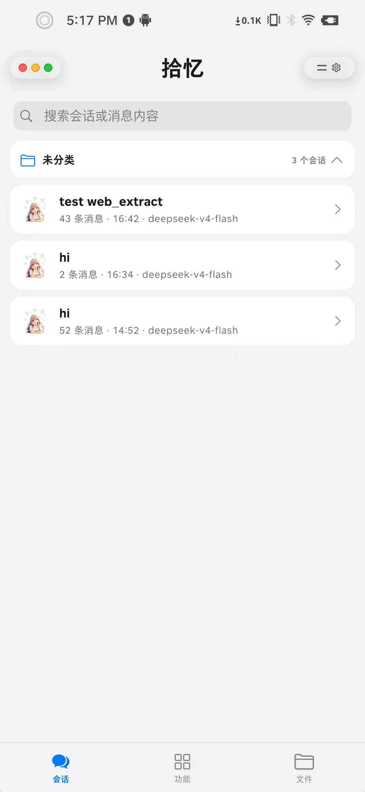 |

| 会话（目录工具） | 会话（工具调用） | 会话（消息操作） |
| --- | --- | --- |
| 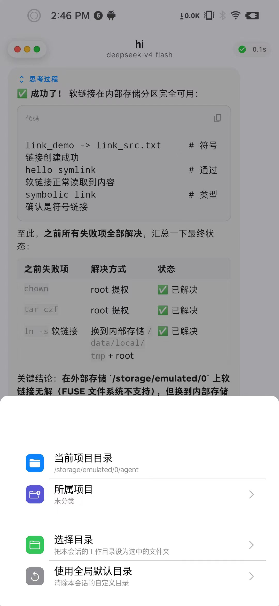 | 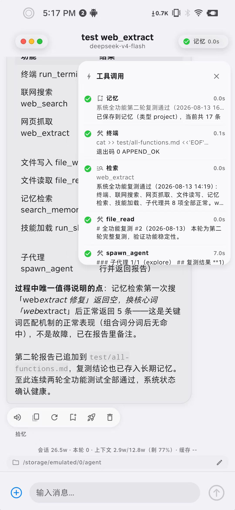 | 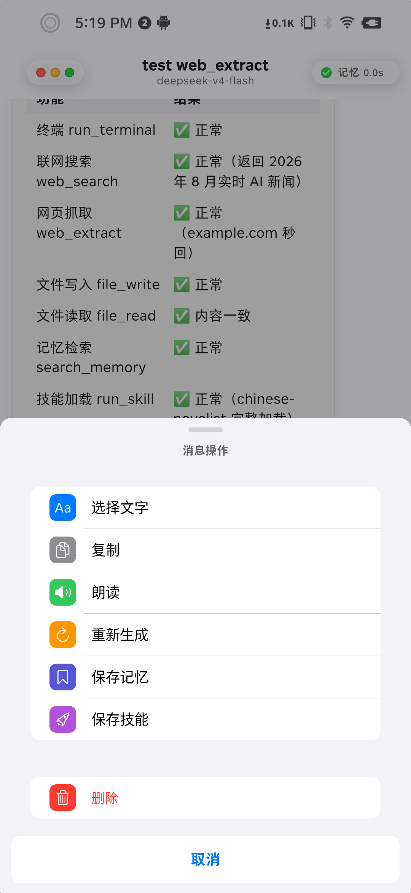 |

**功能与文件**

| 功能 | 长期记忆 | 技能 |
| --- | --- | --- |
| 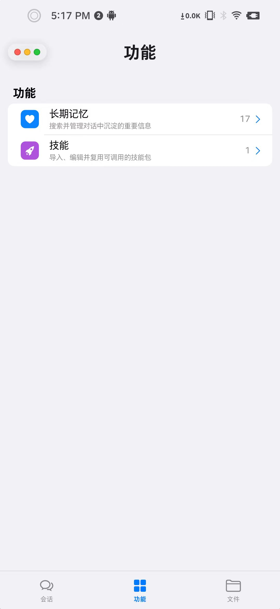 | 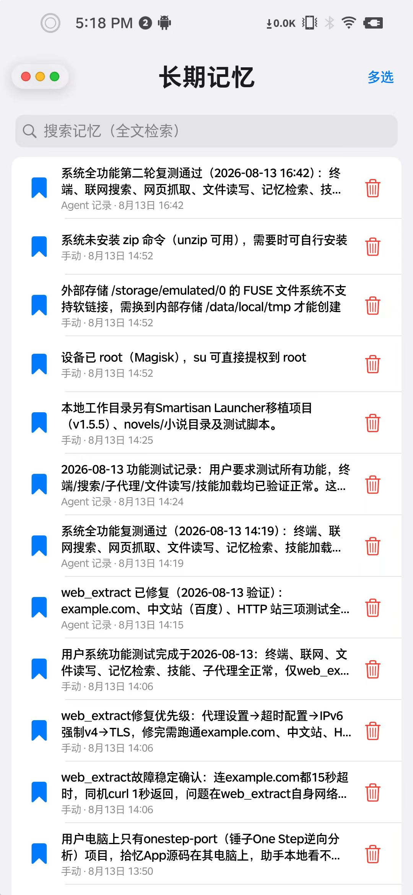 | 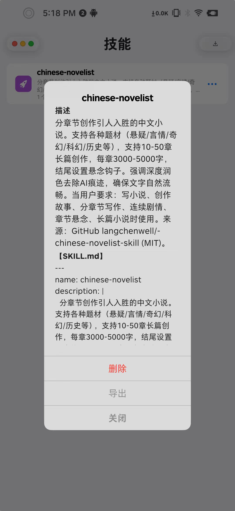 |

| 文件 | 设置 | 模型 API |
| --- | --- | --- |
| 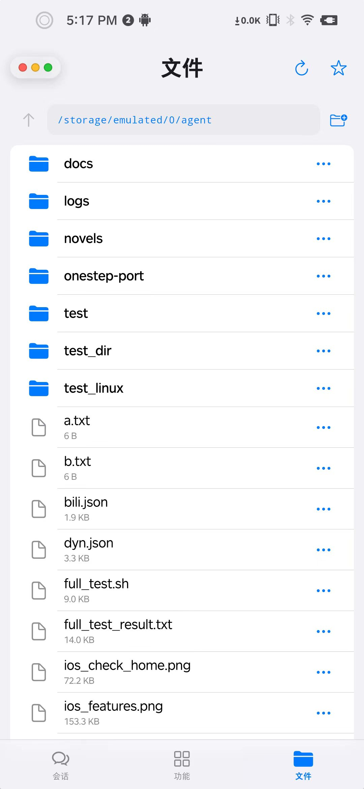 | 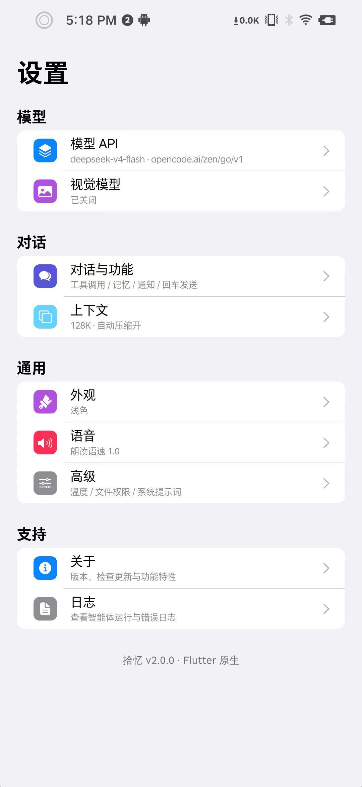 | 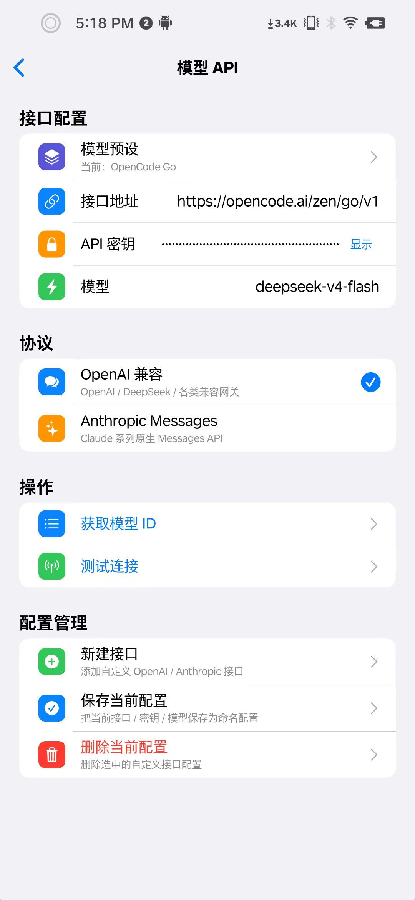 |

**设置与关于**

| 对话与功能 | 上下文 | 关于 |
| --- | --- | --- |
| 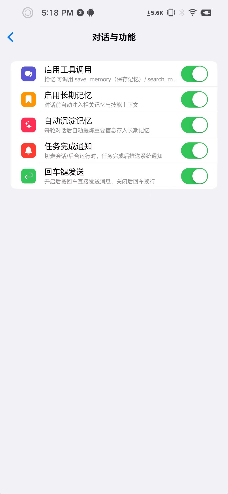 | 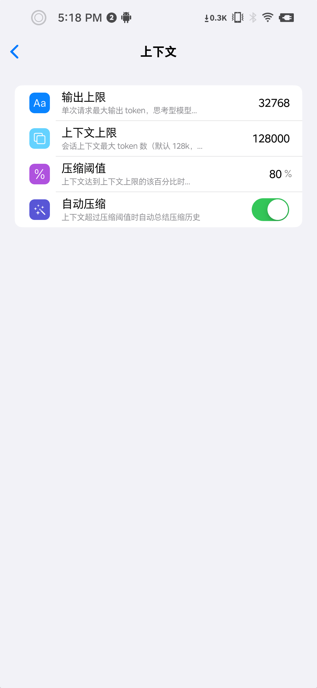 | 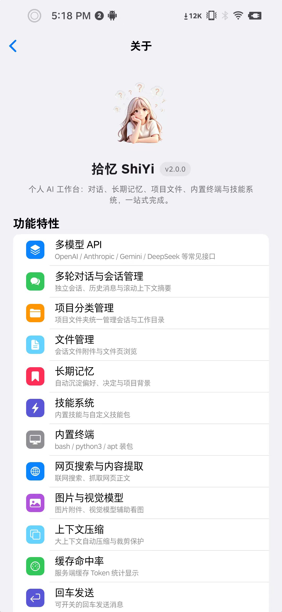 |

### 1.0 旧版界面预览

> 2.5 延续 2.0 的 Apple 设计理念（HIG），以下为 1.0 版本的历史界面，保留作对比参考。

| 主页 | 侧边栏 | 记忆 |
| --- | --- | --- |
|  | 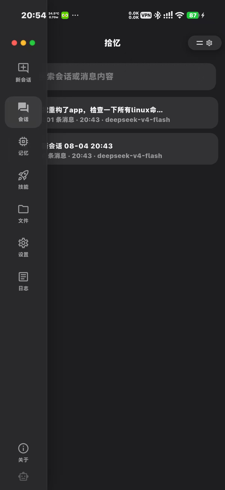 | 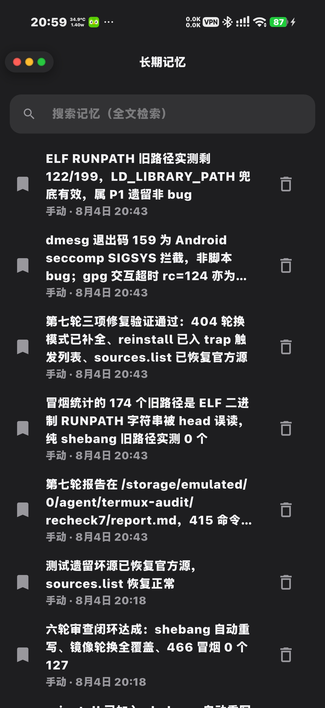 |

| 技能 | 文件 | 设置 | 关于 |
| --- | --- | --- | --- |
|  |  | 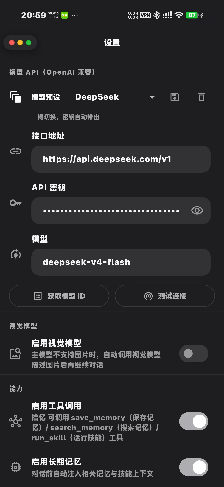 | 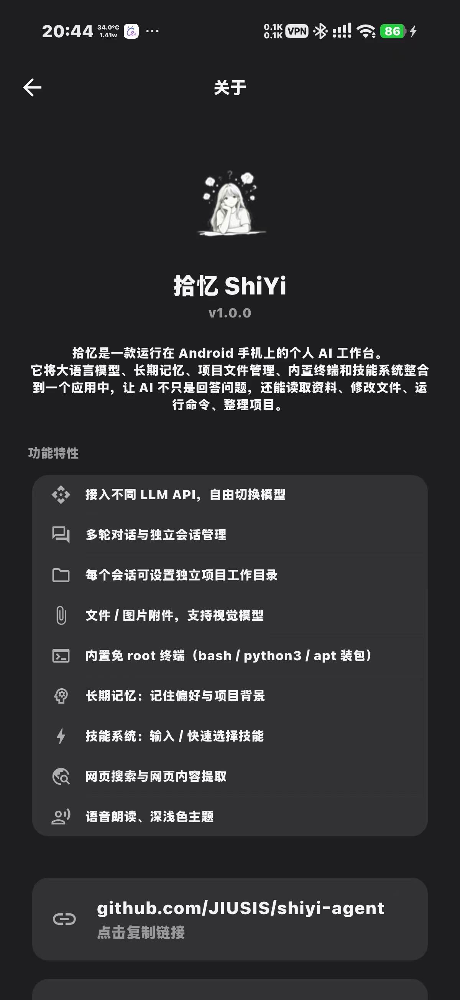 |

## 安装

1. 从 [Releases](https://github.com/JIUSIS/shiyi-agent/releases) 下载 APK（Android 8.0+）
2. 安装后打开应用，完成初始配置
3. 首次启动会自动部署内置 Alpine 终端环境（约 4MB 资产 + 首次初始化），请耐心等待

> 提示：更新版本请直接覆盖安装（`adb install -r` 或允许系统覆盖），不会清除本地数据。

## 快速开始

1. 打开 **设置**，填写 LLM API 信息（Base URL / API Key）并选择模型
2. 返回首页，点击 **新建项目** 并选择文件夹位置
3. 在项目横幅左滑可 **新建会话 / 设置项目文件夹 / 重命名 / 删除**；项目操作都在主页完成
4. 开始对话；需要处理文件或运行命令时，直接让 AI 在当前项目目录中完成操作

## 核心设计

### 独立项目目录

项目可以设置统一的工作目录，项目下没有单独设置目录的会话会自动继承；每个会话也仍可覆盖为自己的独立目录。AI 在当前会话中创建、读取和修改的文件默认围绕生效的工作目录管理，不同项目互不干扰。

### 内置终端

Android 端集成了移动端终端环境（bash + python3），不需要额外安装 Termux。它基于 Android 应用沙箱 + 内嵌用户空间（proot + Alpine Linux minirootfs）实现，首次启动自动部署；在无 root 设备上，是否可用取决于系统 SELinux 对内嵌 ELF 执行和文件操作的限制。主页底部「终端」栏与 AI 工具走同一条 `init-host` 启动链。Windows 端使用本机 WSL、Git Bash、PowerShell 7 或 cmd。

### 技能系统

支持加载不同技能，让 AI 按照指定流程完成资料整理、代码分析、内容创作、报告生成、小说写作与审计等任务。技能即流程，一次配置，反复复用。

## 技术栈

| 层次 | 技术 |
| --- | --- |
| 客户端 | Flutter 3.44.2 / Dart 3.12.2（Android `compileSdk 36` / `targetSdk 36`，Windows 桌面） |
| 数据存储 | SQLite（会话与消息）、SharedPreferences（设置） |
| 终端环境 | 内置 Alpine Linux 用户空间（minirootfs 固化进 assets + proot 沙箱，apk 包管理） |
| 模型接入 | OpenAI Chat Completions / Responses、Anthropic Messages、其他兼容 LLM API + 多模态图片处理 |

## 从源码构建

```bash
# 安装依赖
flutter pub get

# 运行（debug）
flutter run

# 构建 release APK（需先配置签名，见下）
flutter build apk --release
```

Windows 桌面版：

```bash
flutter build windows --release
```

Windows 分发时需要连同 `build/windows/x64/runner/Release/` 目录中的依赖文件一起分发。

### 签名配置

`android/app/build.gradle.kts` 的 **release 与 debug 变体统一使用**项目根目录的 `keystore.jks`（keyAlias 为 `shiyi`），签名密码从 `android/local.properties` 的 `KEYSTORE_PASSWORD` 或环境变量 `KEYSTORE_PASSWORD` 读取。

> debug 变体也用正式签名的原因：覆盖安装到装有正式版的真机不会因签名不一致失败/清数据；同时 debug 包仍可 `run-as` 备份数据。注意：**构建 debug 也需要配置签名密码**（没有密码时 debug 构建同样会失败）。

首次构建需要：

```bash
# 1. 生成签名密钥（只需一次；请务必妥善保管密码）
keytool -genkeypair -v -keystore keystore.jks -keyalg RSA -keysize 2048 \
  -validity 10000 -alias shiyi -dname "CN=ShiYi, OU=ShiYi, O=ShiYi, L=Beijing, ST=Beijing, C=CN"

# 2. 配置密码（二选一）
#    方式 A：写入 android/local.properties（不入库）
echo "KEYSTORE_PASSWORD=你的密码" >> android/local.properties
#    方式 B：构建时用环境变量
export KEYSTORE_PASSWORD="你的密码"
flutter build apk --release
```

> 注意：`keystore.jks` 与 `android/local.properties` 均被 `.gitignore` 排除，**不随源码提交**。丢失密钥意味着无法再对已发布的版本做覆盖更新（签名不一致），请务必备份。


## 隐私与数据

- 会话、设置、长期记忆和项目数据**默认保存在设备本地**，不上传任何服务器
- 发送给模型的内容取决于你配置的 API 服务与实际对话内容
- 使用第三方 LLM API 时，请了解对应服务商的隐私政策

## 开源许可证

本项目基于 [GPL-3.0](LICENSE) 协议开源。使用、修改与分发请遵守 GPL-3.0 条款。

---

**拾忆 ShiYi** · 让每一次对话，都留下成果。
